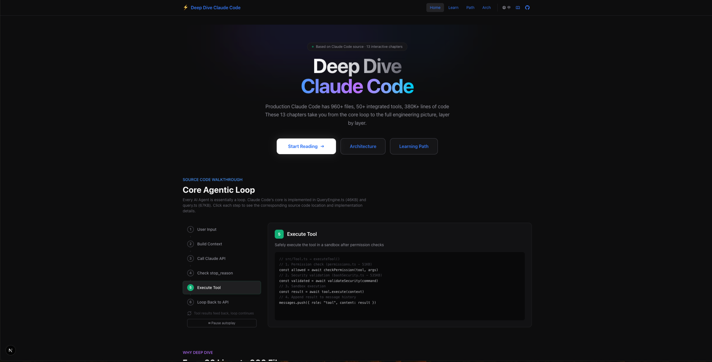
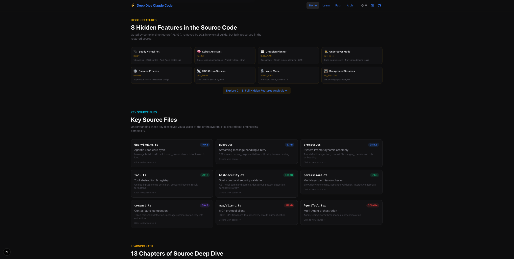
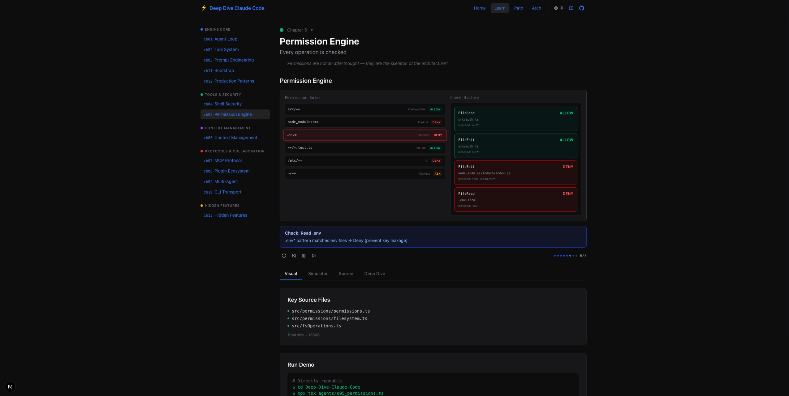

# Deep Dive Claude Code

**English** | [中文](./README.zh-CN.md)

> Production-grade Claude Code has 960+ files, 50+ integrated tools, and 380K+ lines of code.
> These 13 chapters take you from the core loop to the full engineering picture, layer by layer.

**👉 [Live Demo](https://deep-dive-claude-code.vercel.app/)**







## 📚 13-Chapter Learning Path

```
Phase 1: Core Loop                  Phase 2: Security
========================          ========================
Ch01  Agent Loop          ★★★    Ch04  Shell Security      ★★★
      The essence of all Agents         300KB+ security code
      |                                 |
Ch02  Tool System         ★★☆    Ch05  Permission Engine   ★★☆
      50+ tool registration             Every op is checked
      |
Ch03  Prompt Engineering  ★★☆
      Dynamic assembly pipeline

Phase 3: Context & Extensions       Phase 4: Collaboration & Eng.
========================          ========================
Ch06  Context Management  ★★★    Ch09  Multi-Agent         ★★☆
      Infinite work in finite ctx       Agent/Team/Swarm
      |                                 |
Ch07  MCP Protocol        ★★☆    Ch10  CLI Transport       ★☆☆
      Unified tool-call standard        SSE/WS/Hybrid
      |                                 |
Ch08  Plugin Ecosystem    ★☆☆    Ch11  Bootstrap Optim.    ★☆☆
      Extensible capabilities           Fast path + prefetch
                                        |
                                  Ch12  Production Patterns ★★★
                                        Demo → Production

Phase 5: Hidden Features
========================
Ch13  Hidden Features     ★★★
      Buddy · Kairos · Ultraplan
      Undercover · Daemon · UDS
```

## 📖 About

This project is based on the source code of [Claude Code](https://github.com/anthropics/claude-code). Through **13 progressive chapters**, it helps developers understand the internal architecture and engineering decisions of a **production-grade AI coding assistant**.

The project consists of three core parts:

| Part | Description |
|------|-------------|
| 📖 **Deep-dive Docs** (`docs/`) | 13 source code analysis documents, each focusing on a core subsystem |
| 💻 **Runnable Demos** (`agents/`) | 12 TypeScript demo programs, each independently runnable |
| 🌐 **Interactive Platform** (`web/`) | Next.js web app with visualizations, simulator, and source viewer |

## 📋 Chapter Index

| Ch | Title | Motto | Key Source Files |
|----|-------|-------|-----------------|
| [Ch01](./docs/ch01-agent-loop.md) | Agent Loop | *The essence of all Agents is a loop* | `QueryEngine.ts` + `query.ts` |
| [Ch02](./docs/ch02-tool-system.md) | Tool System | *Register a handler, gain an ability* | `Tool.ts` + `tools.ts` |
| [Ch03](./docs/ch03-prompt-engineering.md) | Prompt Engineering | *System Prompt is a dynamically assembled pipeline* | `prompts.ts` + `claudemd.ts` |
| [Ch04](./docs/ch04-bash-security.md) | Shell Security | *The most powerful tool needs the tightest defense* | `bashSecurity.ts` + `bashParser.ts` |
| [Ch05](./docs/ch05-permissions.md) | Permission Engine | *Permissions are the skeleton, not an afterthought* | `permissions.ts` + `filesystem.ts` |
| [Ch06](./docs/ch06-context-management.md) | Context Management | *Context always fills up — the key is how to compress* | `compact.ts` + `SessionMemory/` |
| [Ch07](./docs/ch07-mcp-protocol.md) | MCP Protocol | *MCP turns any service into an AI tool* | `mcp/client.ts` + `mcp/auth.ts` |
| [Ch08](./docs/ch08-plugin-ecosystem.md) | Plugin Ecosystem | *Plugins are capability multipliers* | `pluginLoader.ts` |
| [Ch09](./docs/ch09-multi-agent.md) | Multi-Agent | *Scale comes from division of labor, not bigger context* | `AgentTool.tsx` + `swarm/` |
| [Ch10](./docs/ch10-cli-transport.md) | CLI Transport | *The transport layer decides where an Agent can run* | `cli/transports/` |
| [Ch11](./docs/ch11-bootstrap.md) | Bootstrap Optimization | *Fast path defines experience, full path defines capability* | `dev-entry.ts` → `cli.tsx` → `main.tsx` |
| [Ch12](./docs/ch12-production-patterns.md) | Production Patterns | *Making an Agent reliable takes 10x the engineering* | `sessionStorage.ts` + `analytics/` |
| [Ch13](./docs/ch13-hidden-features.md) | **Hidden Features** | *Every `feature('FLAG')` line hides a product decision* | `buddy/` + `ultraplan.tsx` + `undercover.ts` |

## 🚀 Getting Started

### Web Platform (Recommended)

```bash
cd Deep-Dive-Claude-Code/web
npm install
npm run build    # Compile docs + source → build
npm run dev      # http://localhost:3200
```

Each chapter page has 4 tabs:
- **Visualization** — Interactive step-by-step animations (13 components)
- **Simulator** — Agent loop message replay (13 scenarios)
- **Source** — Key code snippets with TypeScript syntax highlighting
- **Deep Dive** — Full Markdown document rendering

Source file cards on the home page are **clickable** and jump to the source viewer with search highlighting.

### CLI Demos

```bash
cd Deep-Dive-Claude-Code
npm install
npx tsx agents/s01_agent_loop.ts    # Requires API Key
npx tsx agents/s04_bash_security.ts # No API Key needed — try this!
```

## 📁 Project Structure

```
Deep-Dive-Claude-Code/
├── README.md                        # This file (English)
├── README.zh-CN.md                  # 中文版
├── imgs/                            # Screenshots
│
├── docs/                            # 📖 13 deep-dive documents
│   ├── ch01-agent-loop.md
│   ├── ch02-tool-system.md
│   ├── ch03-prompt-engineering.md
│   ├── ch04-bash-security.md
│   ├── ch05-permissions.md
│   ├── ch06-context-management.md
│   ├── ch07-mcp-protocol.md
│   ├── ch08-plugin-ecosystem.md
│   ├── ch09-multi-agent.md
│   ├── ch10-cli-transport.md
│   ├── ch11-bootstrap.md
│   ├── ch12-production-patterns.md
│   └── ch13-hidden-features.md
│
├── agents/                          # 💻 12 runnable demo programs
│   ├── s01_agent_loop.ts
│   ├── ...
│   └── s12_production.ts
│
├── source-code/                     # 📂 Core source files (from main repo)
│   ├── QueryEngine.ts
│   ├── query.ts
│   ├── Tool.ts
│   ├── constants/prompts.ts
│   ├── tools/BashTool/
│   ├── tools/AgentTool/
│   ├── utils/permissions/
│   ├── services/mcp/
│   └── services/compact/
│
├── web/                             # 🌐 Next.js interactive platform
│   ├── src/
│   │   ├── app/                     # Pages (home, chapters, architecture, source viewer)
│   │   ├── components/              # Visualizations, simulator, layout, docs renderer
│   │   ├── hooks/                   # useSteppedVisualization + useSimulator
│   │   ├── data/                    # Scenarios JSON + generated docs/sources
│   │   └── lib/                     # Constants + utilities
│   └── scripts/                     # Build scripts (docs→JSON, sources→JSON)
│
├── package.json                     # agents/ dependencies
└── .env.example                     # API Key template
```

## 🛠️ Tech Stack

### Learning Platform (web/)

| Technology | Purpose |
|-----------|---------|
| **Next.js 15** | React framework, App Router |
| **Tailwind CSS 4** | Dark theme styling |
| **Framer Motion** | Interactive animations |
| **Lucide React** | Icon library |
| **unified + remark + rehype** | Markdown rendering pipeline |

### Analyzed Project (Claude Code)

| Layer | Technology |
|-------|-----------|
| Runtime | Bun 1.3.5+ |
| Language | TypeScript (~960 .ts/.tsx files) |
| Terminal UI | React Ink |
| CLI Framework | Commander.js |
| Tool Protocol | MCP (Model Context Protocol) |
| A/B Testing | GrowthBook |
| Compile-time Elimination | `feature()` macro (bun:bundle) |

## 🙏 Acknowledgments

This project would not exist without the following open-source projects:

- **[claude-code-rev](https://github.com/oboard/claude-code-rev)** — Claude Code source restoration project providing complete TypeScript source code with local build support. All source code analyzed in this project originates from here.
- **[claw-code](https://github.com/instructkr/claw-code)** — Pioneer in Claude Code source analysis, providing excellent analysis approaches and documentation references.
- **[claudecode-src Wiki](https://cnb.cool/nfeyre/claudecode-src/-/wiki)** — Comprehensive file-by-file Claude Code source analysis Wiki.
- **[learn-claude-code](https://github.com/shareAI-lab/learn-claude-code)** — Interactive Agent teaching project. The web platform's interaction patterns (stepped visualization + agent simulator + source viewer) were inspired by this project.

Thank you to all the authors and contributors!
